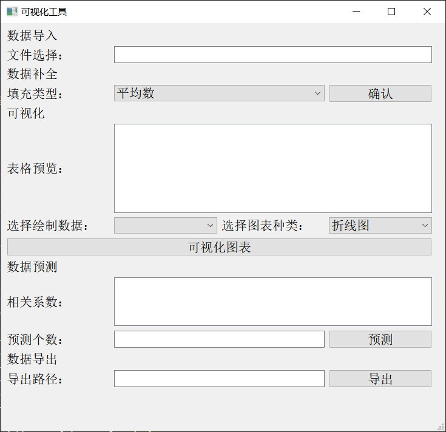
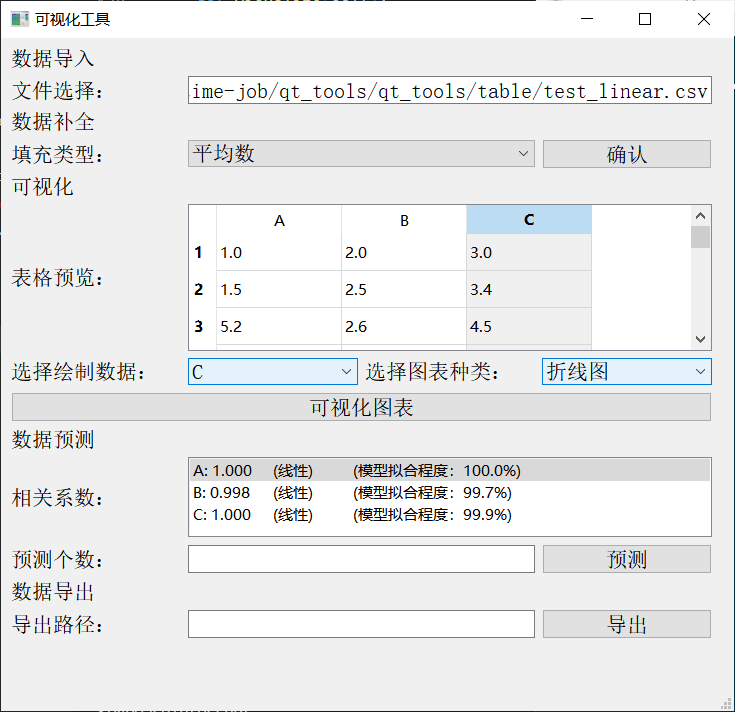
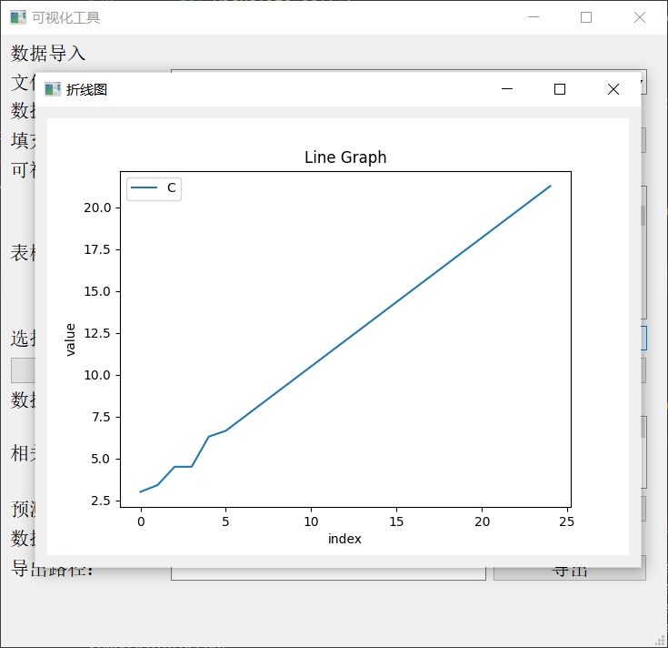

# qt_tools

> 基于PyQt5、Pandas、Sklearn等主要库函数实现的**csv表格**数据预处理（缺失值填充）、数据可视化、数据预测、数据导出的工具

## 使用方法

1. 下载仓库：`git clone https://github.com/chengyingshe/qt_tools.git`
2. 进入项目文件夹：`cd qt_tools`
3. 下载依赖库：`pip install -r requirements.txt`
4. 运行：`python main.py`

## 效果展示

初始状态：

选择文件：

可视化：

## 原理介绍

### 数据预处理

数据缺失值的填充有三种方式可供选择：**平均值**、**众数**、**中位数**，当导入的数据表格中有数据确实时会提示进行数据补全，选择其中一种补全方式，补全完成后太能进行后续数据可视化等操作。

### 数据可视化

数据可视化部分可以选择表格中的指定列数据绘制：**折线图**、**条形图**、**饼状图**、**直方图**。

### 数据预测

可以指定每一列数据预测的数据个数，根绝每列数据的相关系数来决定使用那种预测算法：当列数据具有线性相关性时（`abs(相关系数) > 0.5`）使用线性回归算法预测指定个数的新数据并插入到表格末尾；当列数据不具有线性相关性时使用KNN算法（`K=5`）预测指定个数的新数据并插入到表格末尾。

### 数据导出

能够将数据填充、数据预测后产生的新数据导出到指定文件夹中，导出为`.csv`文件